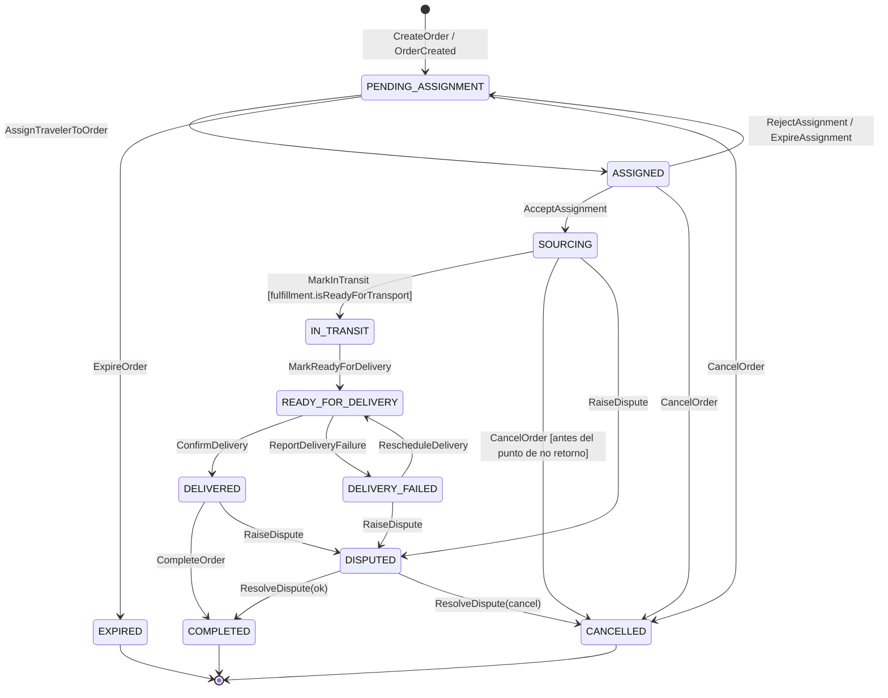
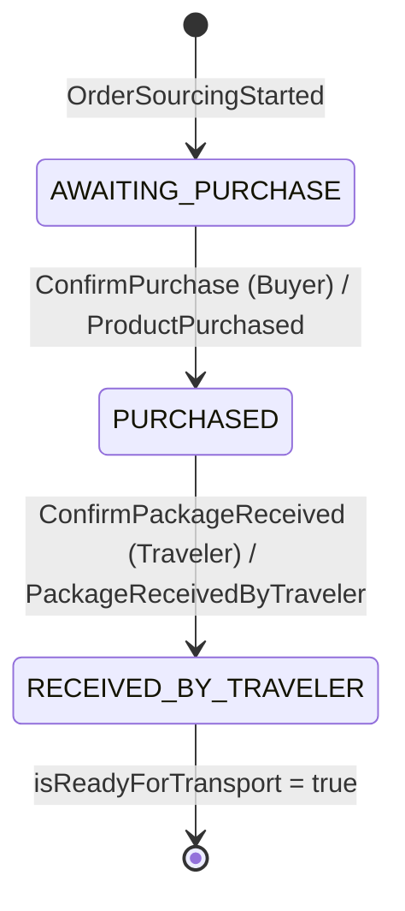

# Bringo — Documento de Dominio

> Autor: domain-architect
> Estado: propuesta para revisión del orquestador y del software-architect
> Fecha: 2026-07-06
> Fuentes de verdad: `.claude/skills/bringo-domain-knowledge/SKILL.md`,
> `.claude/skills/ddd-modular-monolith/SKILL.md`

Este documento define el **modelo de dominio** de Bringo: bounded contexts,
agregados e invariantes, value objects, la máquina de estados del pedido, los
eventos de dominio, los casos de uso núcleo y el glosario de lenguaje ubicuo.

No contiene esquema de base de datos, endpoints, DTOs ni el algoritmo de
matching: esas decisiones pertenecen a `database-engineer`, `api-designer` y
`matching-engine-architect` respectivamente. Aquí se define **qué es** cada
cosa en el negocio y **qué reglas nunca pueden violarse**, no cómo se persiste
ni cómo se expone.

Convención: la prosa va en español; los identificadores y términos técnicos
del modelo van en inglés (`Order`, `Trip`, `FulfillmentStrategy`, etc.), como
es habitual y para que coincidan 1:1 con el código futuro.

---

## 1. Principios rectores del modelo

1. **Primero el negocio.** Cada límite y cada invariante se justifica por una
   razón de negocio; la técnica es consecuencia, no causa.
2. **El estado del pedido es dominio, no una columna.** La máquina de estados
   vive en el agregado `Order`; cada transición es un método con guardas que
   emite un evento de dominio. Nunca un `UPDATE status` silencioso.
3. **Extensibilidad de Fulfillment desde el día uno.** Agregar un nuevo tipo
   de cumplimiento debe ser *agregar una clase*, no *modificar* `Order`, `Trip`
   ni `Assignment`. Esto condiciona todo el diseño de la máquina de estados.
4. **Multi-corredor por datos, no por código.** Soportar España→El Salvador o
   México→Guatemala debe ser insertar filas de catálogo, no desplegar código.
5. **Referencias entre agregados por identidad.** Un agregado nunca contiene
   el objeto de otro agregado; contiene su id. Esto preserva los límites de
   consistencia y habilita una futura extracción a servicios.

---

## 2. Bounded contexts

Un bounded context agrupa lo que **cambia por la misma razón** y aísla lo que
cambia por razones distintas (regla de decisión del skill
`ddd-modular-monolith`). Bringo se organiza en los siguientes contextos.

### 2.1 Contextos núcleo (core domain)

| Contexto | Qué contiene | Cambia cuando cambian… |
|---|---|---|
| **Ordering** (demanda) | `Order` (raíz) + `Fulfillment` (entidad interna) + `BuyerProfile` | las reglas del ciclo de vida del pedido y los tipos de cumplimiento |
| **Trips** (oferta) | `Trip` (raíz) + `TravelerProfile` | las reglas de publicación de viajes y de capacidad |
| **Matching** | `Assignment` (raíz) + política de asignación | el algoritmo/criterios con que se asigna un Traveler a un pedido |

Estos tres son el corazón competitivo de Bringo y por eso están separados:

- **Ordering vs Trips.** Son los dos lados del marketplace. Cambian por
  motivos opuestos (reglas de demanda vs. reglas de oferta), tienen actores
  distintos (Buyer vs. Traveler) e invariantes distintas. Fusionarlos crearía
  un módulo "bolsa de gatos" donde una regla de viajes obligaría a recompilar
  la lógica de pedidos.
- **Matching separado de ambos.** El criterio de "cuál es el mejor Traveler"
  evolucionará muchas veces (nuevos pesos, nuevos corredores, reputación) sin
  que deba cambiar la definición de qué es un `Order` o un `Trip`. Aislarlo
  permite que `matching-engine-architect` itere sin tocar los agregados
  núcleo. `Matching` **lee** demanda y oferta y **produce** un `Assignment`.

### 2.2 Contextos de soporte (supporting)

| Contexto | Qué contiene | Por qué es de soporte |
|---|---|---|
| **Reputation** | `Rating` (raíz) + cálculo de `Reputation` | habilita al matching y a la confianza, pero no es el intercambio en sí |
| **Identity & Access** | `User` (raíz) + roles | identidad y credenciales; comparte frontera con `security-engineer` |
| **Incidents** | `Dispute` (raíz) | resolución de incidencias por Admin; mínimo en MVP |

- **Reputation aparte de Trips.** La forma de calcular reputación (promedio,
  ponderación por recencia, tiers) cambiará por razones propias y no debe
  arrastrar cambios en el viaje. `Reputation` **publica** un snapshot
  (`Reputation` VO) que `Trips`/`Matching` consumen de solo lectura.
- **Identity & Access.** El dominio necesita el concepto de identidad y roles,
  pero **no** posee tokens ni sesiones (ver 3.4 y 12). Frontera compartida:
  el dominio define `User`/roles; `security-engineer` define autenticación,
  refresh tokens y guards.

### 2.3 Subdominios genéricos (generic)

| Contexto | Qué contiene | Naturaleza |
|---|---|---|
| **Geography** | `Country`, `City` (entidades de catálogo) + `Corridor` (VO) | datos de referencia; shared kernel de solo lectura |
| **Notifications** | `Notification` | reactivo a eventos de dominio; sin lógica de negocio propia |

- **Geography como shared kernel.** `Country`/`City` son datos de referencia
  consumidos por casi todos los contextos. Se comparten en modo solo lectura.
  Añadir un país/ciudad es un cambio de **datos**, no de código: esta es la
  pieza que habilita el multi-corredor (ver sección 11).
- **Notifications como consumidor de eventos.** No decide nada del negocio;
  se suscribe a eventos de dominio (`OrderAssigned`, `OrderDelivered`, …) y
  entrega mensajes. El **cómo** se transporta el evento lo decide
  `software-architect`; aquí solo se declara que los eventos existen.

### 2.4 Contextos futuros, explícitamente fuera del MVP

- **Payments / Settlement.** Hoy el dinero es solo descriptivo
  (`estimatedPrice`); no hay cobro, escrow ni reembolso. Los estados
  `REFUNDED` y la resolución económica de disputas **dependen de un contexto
  Payments que aún no existe**. Se señala como brecha (sección 13), no se
  modela.
- **Auth/Session.** Refresh tokens y sesiones son de `security-engineer`; no
  son agregados de dominio.

### 2.5 Mapa de relaciones entre contextos

```
Identity&Access ──(UserId, upstream)──▶ Ordering, Trips
Geography ──(shared kernel, solo lectura)──▶ Ordering, Trips, Matching
Ordering ─(demanda)─┐
                    ├──▶ Matching ──(reserva capacidad)──▶ Trips
Trips ───(oferta)───┘
Reputation ──(published language: Reputation snapshot)──▶ Trips, Matching
Reputation ◀──(lee Order DELIVERED / Rating)── Ordering
Ordering, Trips, Matching, Reputation ──(eventos de dominio)──▶ Notifications
```

Todo esto vive en **un monolito modular**: un módulo NestJS por contexto, con
las 4 capas del skill `ddd-modular-monolith`. Los límites están dibujados de
forma que cualquiera podría extraerse a un servicio sin reescribir su lógica.

---

## 3. Análisis crítico de las entidades propuestas

Lista propuesta por el usuario: `User, Buyer, Traveler, Trip, Route, Order,
Assignment, Fulfillment, Notification, Rating, Country, City`.

### 3.1 Veredicto por concepto

| Concepto propuesto | Veredicto | Rol en el modelo |
|---|---|---|
| `User` | **Aggregate Root** (IAM) — redefinido | Identidad + credenciales + roles. Se separa de los perfiles de rol. |
| `Buyer` | **Aggregate Root** (Ordering) — renombrado `BuyerProfile` | Perfil de rol de un `User`. Referenciado por `Order`. |
| `Traveler` | **Aggregate Root** (Trips) — renombrado `TravelerProfile` | Perfil de rol de un `User`. Referenciado por `Trip`/`Assignment`. Cachea snapshot de reputación. |
| `Trip` | **Aggregate Root** (Trips) | Oferta de transporte con capacidad. |
| `Route` | **Eliminado → `Corridor` (VO)** | Sinónimo suelto de "corredor"; se elimina para no duplicar lenguaje (ver 3.3). |
| `Order` | **Aggregate Root** (Ordering) | Pedido con máquina de estados. Contiene `Fulfillment`. |
| `Assignment` | **Aggregate Root** (Matching) | Resultado del matching: quién fue elegido y con qué score. |
| `Fulfillment` | **Entidad interna de `Order`** + comportamiento vía `FulfillmentStrategy` | No es agregado propio (ver 7). |
| `Notification` | **Aggregate Root** (Notifications, genérico) | Reactivo a eventos; sin lógica de negocio. |
| `Rating` | **Aggregate Root** (Reputation) | Calificación de una parte hacia la otra por un pedido. |
| `Country` | **Entidad de catálogo** (Geography) | Dato de referencia (ISO code). |
| `City` | **Entidad de catálogo** (Geography) | Dato de referencia, pertenece a un `Country`. |

### 3.2 Conceptos que faltan (se añaden)

**Separación identidad vs. perfil de rol (crítico).** Un mismo `User` puede
ser simultáneamente Buyer y Traveler (alguien que compra y que también viaja).
Si `Buyer` y `Traveler` fueran la identidad, esa persona necesitaría dos
cuentas y dos logins: absurdo para el negocio. Por eso:

- `User` (IAM): identidad, credenciales, y **roles** (`{BUYER, TRAVELER,
  ADMIN}`).
- `BuyerProfile` / `TravelerProfile`: datos y estado propios de cada rol,
  ligados 1:1 (opcional) a un `User` por `UserId`.

Esto también responde a "identidad/credenciales vs. perfiles de rol": son
cosas que cambian por razones distintas (seguridad vs. marketplace).

**Value Objects que faltaban** (justificados en la sección 5):
`EmailAddress`, `Address`, `Money`, `ProductReference`, `Corridor`,
`Capacity`, `TravelWindow`, `RatingScore`, `Reputation`, `FulfillmentType`,
`OrderStatus`, `AssignmentStatus`, `FulfillmentStatus`.

**Otros conceptos que faltaban:**
- `Dispute` (agregado de soporte): sin él no hay forma de modelar el estado
  `DISPUTED` ni la responsabilidad del Admin de "resolver incidencias".
- **Historial de estados / eventos del pedido.** El skill exige un evento por
  transición. La *fuente de verdad* es el flujo de eventos de dominio; el
  `OrderStatusHistory` es una **proyección de solo lectura** derivada de esos
  eventos (su persistencia la decide `database-engineer`). No se modela como
  entidad mutable del agregado.

### 3.3 Conceptos que sobran o se fusionan

- **`Route` → `Corridor`.** El matching opera a nivel país-origen →
  país-destino (skill de dominio). "Route" y "Corridor" designarían lo mismo;
  mantener ambos crea sinónimos sueltos entre módulos, justo lo que el
  glosario prohíbe. Se conserva **`Corridor`** como término ubicuo y se
  elimina `Route`. La ciudad de entrega (más fina que el corredor) vive dentro
  de `Address`, no como un "Route" separado.

### 3.4 Conceptos que el usuario mencionó y NO son de dominio

- **`RefreshToken` / `Session`.** No son agregados del dominio de negocio;
  pertenecen al contexto Auth/Session de `security-engineer` y a su
  infraestructura. El dominio solo conoce `User` y sus roles. Modelarlos aquí
  filtraría una preocupación de seguridad dentro del núcleo. Se excluyen
  deliberadamente.

---

## 4. Agregados e invariantes

Para cada agregado: raíz, qué protege, qué **nunca puede ser cierto** y qué
**siempre debe cumplirse**. Las invariantes marcadas con [SKILL] provienen
del skill de dominio y son de cumplimiento obligatorio.

### 4.1 `Order` (raíz) — contexto Ordering

**Protege:** la coherencia del ciclo de vida de un pedido y la relación con su
`Fulfillment`.

Contenido: `orderId`, `buyerId` (ref), `productReference: ProductReference`,
`deliveryAddress: Address`, `purchaseCountry: CountryRef`, `status:
OrderStatus`, `fulfillment: Fulfillment` (entidad interna), `currentAssignmentId?`
(ref), marcas de tiempo, `reassignmentCount`.

Invariantes:
- **Siempre:** `status` solo cambia siguiendo el grafo de transiciones de la
  sección 6. Cualquier comando cuyo estado origen no sea válido se rechaza.
- **Nunca:** saltar estados (no se pasa de `PENDING_ASSIGNMENT` a `DELIVERED`
  directamente). [SKILL]
- **Nunca:** entrar en `IN_TRANSIT` si `fulfillment.isReadyForTransport()` es
  falso. (El producto no puede "viajar" antes de estar en poder del Traveler.)
- **Nunca:** más de **una** referencia de asignación activa
  (`currentAssignmentId` apunta a un `Assignment` no terminal); una nueva
  asignación solo es posible desde `PENDING_ASSIGNMENT`. [SKILL]
- **Siempre:** al crearse debe tener `productReference` con URL válida,
  `estimatedPrice` (Money) y un `Corridor` derivable (país de compra + país de
  la ciudad de entrega, ambos en catálogo).
- **Siempre:** los estados terminales (`COMPLETED`, `CANCELLED`, `EXPIRED`)
  son absorbentes: no admiten ninguna transición de salida.

### 4.2 `Fulfillment` — entidad interna de `Order`

**Protege:** el sub-flujo de aprovisionamiento (cómo el producto llega a poder
del Traveler), que **varía por tipo**.

Contenido: `fulfillmentType: FulfillmentType`, `status: FulfillmentStatus`,
datos específicos del tipo. El **comportamiento** lo aporta una
`FulfillmentStrategy` resuelta por `fulfillmentType` (sección 7).

Invariantes:
- **Nunca:** `isReadyForTransport()` = verdadero si no se completaron los
  pasos requeridos por su estrategia (p. ej., en `BUYER_SHIPS_TO_TRAVELER`, no
  puede estar "listo" sin `PackageReceivedByTraveler`).
- **Siempre:** sus sub-transiciones respetan la sub-máquina declarada por su
  estrategia.
- **Nunca:** un `Fulfillment` cambia de tipo tras crearse.

Es entidad **interna** (no agregado propio) porque su estado debe permanecer
transaccionalmente consistente con el `status` del `Order` (no puede existir
`Order = IN_TRANSIT` con `Fulfillment` "aún no comprado"). El límite de
consistencia es el pedido.

### 4.3 `Trip` (raíz) — contexto Trips

**Protege:** la capacidad del viaje y su ventana temporal.

Contenido: `tripId`, `travelerId` (ref), `corridor: Corridor`, `travelWindow:
TravelWindow`, `capacity: Capacity`, `status: TripStatus`.

Invariantes:
- **Nunca:** aceptar más pedidos que la capacidad disponible
  (`capacity.reserved <= capacity.total`). [SKILL]
- **Nunca:** `capacity.reserved < 0`.
- **Siempre:** al publicarse, `travelWindow.arrivalDate` debe ser futura y
  `capacity.total > 0`.
- **Nunca:** `corridor.originCountry == corridor.destinationCountry`.
- **Nunca:** reservar/liberar capacidad en un `Trip` `COMPLETED` o `CANCELLED`.
- **Siempre:** solo los `Trip` en estado que admite matching (`OPEN` con
  capacidad libre y llegada futura) son candidatos para asignación.

Ciclo de vida del viaje (compacto; secundario al del pedido):
`OPEN → CLOSED (partió / dejó de aceptar) → COMPLETED`; `CANCELLED` desde
`OPEN`/`CLOSED`. "Lleno" es una condición derivada de `capacity`, no un estado
almacenado.

### 4.4 `Assignment` (raíz) — contexto Matching

**Protege:** el registro auditable de a quién se asignó un pedido y por qué
(score), y el ciclo aceptar/rechazar/expirar.

Contenido: `assignmentId`, `orderId` (ref), `tripId` (ref), `travelerId`
(ref), `buyerId` (ref), `status: AssignmentStatus`, `score` (del matching,
para auditoría), `expiresAt` (deadline de aceptación), marcas de tiempo.

Invariantes:
- **Siempre:** referencia exactamente **un** `Order` y **un** `Trip`.
- **Nunca:** dos `Assignment` activos (`PENDING_ACCEPTANCE` o `ACCEPTED`) para
  el mismo `Order` a la vez. [SKILL] — se garantiza junto con el estado del
  `Order` (solo se asigna desde `PENDING_ASSIGNMENT`).
- **Nunca:** modificar `score` tras la creación (es evidencia de auditoría).
- **Siempre:** las transiciones de `AssignmentStatus` respetan:
  `PENDING_ACCEPTANCE → ACCEPTED | REJECTED | EXPIRED | CANCELLED`;
  `ACCEPTED → CANCELLED` (abandono posterior, mediado).

Nota de frontera: `Assignment` **registra** el resultado; el **algoritmo** que
elige al mejor candidato y el **log de auditoría por intento** (candidatos
evaluados, motivos de descarte) son de `matching-engine-architect` y no forman
parte de este agregado.

### 4.5 `TravelerProfile` (raíz) — contexto Trips

**Protege:** los datos del rol viajero y su snapshot de reputación para el
matching.

Contenido: `travelerId`, `userId` (ref), `shippingAddress: Address` (dirección
donde recibe productos en `BUYER_SHIPS_TO_TRAVELER`), `reputation: Reputation`
(snapshot cacheado).

Invariantes:
- **Siempre:** ligado a un `User` con rol `TRAVELER`.
- **Siempre:** `shippingAddress` presente si opera con tipos de cumplimiento
  que requieren envío al Traveler.
- **Nunca:** la reputación **bloquea por sí sola** una asignación sin un
  umbral explícito y configurable. [SKILL] — el `Reputation` es solo un dato;
  el umbral es política de matching (sección 10).

### 4.6 `BuyerProfile` (raíz) — contexto Ordering

**Protege:** los datos del rol comprador.

Contenido: `buyerId`, `userId` (ref), libreta de `Address` de entrega,
`reputation: Reputation` (como comprador).

Invariantes:
- **Siempre:** ligado a un `User` con rol `BUYER`.

### 4.7 `Rating` (raíz) — contexto Reputation

**Protege:** que las calificaciones sean legítimas y únicas.

Contenido: `ratingId`, `orderId` (ref), `raterId`, `rateeId`, `direction`
(`BUYER_TO_TRAVELER` | `TRAVELER_TO_BUYER`), `score: RatingScore`, `comment?`,
`createdAt`.

Invariantes:
- **Nunca:** un `Rating` sobre un `Order` que no haya alcanzado `DELIVERED`.
- **Nunca:** dos `Rating` del mismo `rater` hacia el mismo `ratee` por el
  mismo `Order` y dirección (una calificación por parte y sentido).
- **Siempre:** el `rater` es una de las partes del pedido (su Buyer o su
  Traveler).
- **Siempre:** `score` dentro del rango válido (`RatingScore`).

### 4.8 `User` (raíz) — contexto Identity & Access

**Protege:** unicidad de identidad y coherencia de roles.

Contenido: `userId`, `email: EmailAddress`, referencia a credencial (el hash
lo maneja infraestructura/seguridad, no el dominio), `roles: Set<Role>`,
`status` (`ACTIVE | SUSPENDED`).

Invariantes:
- **Nunca:** dos `User` con el mismo `email` (la *regla* es de dominio; su
  *verificación* usa el repositorio en la capa de aplicación — ver sección 10).
- **Siempre:** `email` con formato válido (`EmailAddress`).
- **Nunca:** un `User` `SUSPENDED` inicia acciones de negocio (autorización
  fina la refina `security-engineer`).

### 4.9 `Dispute` (raíz) — contexto Incidents (mínimo en MVP)

**Protege:** el registro de una incidencia y su resolución.

Contenido: `disputeId`, `orderId` (ref), `raisedBy`, `reason`, `status`
(`OPEN | RESOLVED`), `resolution?`.

Invariantes:
- **Siempre:** referido a un `Order` en estado disputable.
- **Nunca:** resuelto sin una `resolution` explícita.

### 4.10 `Country` / `City` (entidades de catálogo) — contexto Geography

Datos de referencia. `Country` identificado por código ISO; `City` pertenece a
un `Country`. Se tratan como catálogo administrable por datos (ver sección 11).

### 4.11 `Notification` (raíz) — contexto Notifications (genérico)

Registro de una notificación derivada de un evento de dominio. Sin invariantes
de negocio relevantes; su ciclo (enviada/leída) es operativo, no de dominio.

---

## 5. Value Objects clave

Un VO se define por **sus atributos** (no por identidad), es **inmutable** y se
reemplaza en bloque. Se usa cuando lo que importa es el *valor*, no *cuál* es.

| VO | Composición | Por qué es VO (justificación de negocio) | Invariante propia |
|---|---|---|---|
| `Money` | `amount`, `currency` | El dinero **nunca** debe existir sin moneda; distintos corredores usan distintas monedas (USD, EUR, MXN). Igualdad por valor. | `amount >= 0`; `currency` requerida |
| `Address` | `street`, `cityRef`, `countryRef`, `postalCode?` | Una dirección es un valor descriptivo, se reemplaza entera; no tiene ciclo de vida propio. Cumple doble rol: entrega (Order) y envío al Traveler. | `city` pertenece a `country`; campos mínimos presentes |
| `Corridor` | `originCountryRef`, `destinationCountryRef` | Un corredor **es** su par de países dirigido; dos corredores con el mismo par son idénticos. Clave del multi-corredor. | `origin != destination`; ambos en catálogo |
| `ProductReference` | `url`, `name`, `quantity`, `estimatedPrice: Money`, `notes?` | Describe *qué comprar* en un comercio externo; Bringo no gestiona ese producto como entidad propia (no es un catálogo interno). | `url` absoluta válida; `name` presente; `quantity >= 1` |
| `Capacity` | `total`, `reserved`, `unit` | La capacidad declarada es un valor; las operaciones `reserve`/`release` devuelven una nueva instancia. Encapsula la aritmética y su invariante. | `0 <= reserved <= total` |
| `TravelWindow` | `departureDate?`, `arrivalDate` | Una ventana temporal se define por sus extremos; igualdad por valor. El matching usa `arrivalDate`. | `departure <= arrival` |
| `RatingScore` | `value` | Un puntaje es un valor acotado, inmutable. Aísla el rango del resto del modelo. | `min <= value <= max` (p. ej. 1..5) |
| `Reputation` | `averageScore`, `ratingsCount`, `tier` | **Snapshot calculado** de la reputación, no una entidad con ciclo propio. Se cachea en `TravelerProfile`/`BuyerProfile` para lectura rápida del matching. | derivado; consistente con sus ratings |
| `EmailAddress` | `value` | Encapsula validación y normalización del correo. | formato válido |
| `FulfillmentType` | enum de los 5 tipos | Discriminador estable del tipo de cumplimiento; clave para resolver la estrategia y para el filtrado de matching. | valor dentro del conjunto conocido |
| `OrderStatus` / `AssignmentStatus` / `FulfillmentStatus` / `TripStatus` | enums | Estados de las máquinas; valores cerrados y comparables. | valor dentro del conjunto |

Nota sobre `Capacity`: el **total declarado** es inmutable (VO), pero el
`Trip` mantiene el estado de reservas reemplazando su `Capacity` en cada
`reserve()`/`release()`. La invariante `0 <= reserved <= total` vive dentro del
VO; "de qué viaje es esa capacidad" vive en el `Trip`. Unidad: **slots** de
paquete en el MVP; peso/volumen en el futuro sin cambiar la forma del VO.

---

## 6. Máquina de estados del pedido (`Order`)

### 6.1 Revisión crítica del borrador del skill

El borrador del skill mezcla en un único enum estados que en realidad
pertenecen a **dos niveles distintos**:

- estados **comunes a cualquier tipo de cumplimiento** (asignación,
  transporte, entrega, cierre), y
- estados **específicos de `BUYER_SHIPS_TO_TRAVELER`** (`WAITING_PURCHASE`,
  `PURCHASED`, `RECEIVED_BY_TRAVELER`).

Si esos tres estados específicos viven dentro del enum de `Order`, entonces
añadir `TRAVELER_PURCHASES_PRODUCT` (no hay "compra del Buyer") o
`LOCAL_INVENTORY` (no hay aprovisionamiento) **obligaría a modificar el enum de
`Order`**, violando el requisito de extensibilidad del día uno. Por tanto, el
diseño correcto **separa el backbone del pedido del sub-flujo de
aprovisionamiento** (que aporta el `Fulfillment`). Este es el cambio de fondo
respecto al borrador.

Cambios concretos respecto al borrador:
- Se **elimina** `CREATED` como estado: era transitorio y redundante con
  `PENDING_ASSIGNMENT`. La acción `CreateOrder` deja el pedido directamente en
  `PENDING_ASSIGNMENT` y emite `OrderCreated`. (Si en el futuro se requieren
  borradores editables, se añade `DRAFT`; no es necesario para el MVP.)
- Se **re-alojan** `WAITING_PURCHASE`, `PURCHASED`, `RECEIVED_BY_TRAVELER`
  como **sub-estados del `Fulfillment`** (sección 7), no del `Order`. El
  backbone del `Order` solo tiene una fase `SOURCING` que los engloba.
- Se **renombra** `WAITING_ASSIGNMENT → PENDING_ASSIGNMENT` (lenguaje ubicuo
  consistente con `PENDING_*`).
- Se **añaden** estados que faltaban: `EXPIRED`, `DELIVERY_FAILED`,
  `DISPUTED`. `REFUNDED` se documenta como **futuro** (depende de Payments).
- **`REJECTED_BY_TRAVELER` NO se añade** como estado del `Order`: el rechazo
  del Traveler devuelve el pedido a `PENDING_ASSIGNMENT` y queda registrado en
  el `Assignment` (`status = REJECTED`) y en el evento `AssignmentRejected`.
  Crear un estado de pedido para esto duplicaría información.

### 6.2 Backbone del `Order` (agnóstico al tipo de cumplimiento)

Estados del backbone (los únicos que conoce `Order`):

```
PENDING_ASSIGNMENT → ASSIGNED → SOURCING → IN_TRANSIT
   → READY_FOR_DELIVERY → DELIVERED → COMPLETED
```
más los estados de excepción `DELIVERY_FAILED`, `DISPUTED` (recuperables) y
los terminales `CANCELLED`, `EXPIRED`.



### 6.3 Tabla de transiciones (backbone)

| # | De → A | Actor que dispara | Comando (use case) | Guarda (invariante de dominio) | Evento(s) emitido(s) |
|---|---|---|---|---|---|
| 1 | (inicio) → `PENDING_ASSIGNMENT` | Buyer | `CreateOrder` | product/price/corridor válidos; `FulfillmentType` resoluble; estrategia requiere asignación | `OrderCreated` |
| 2 | `PENDING_ASSIGNMENT` → `ASSIGNED` | Sistema (Matching) | `AssignTravelerToOrder` | existe `Trip` compatible con capacidad libre; pedido en `PENDING_ASSIGNMENT` | `TravelerAssigned`, `OrderAssigned`, `TripCapacityReserved` |
| 3 | `PENDING_ASSIGNMENT` → `EXPIRED` | Sistema | `ExpireOrder` | venció ventana de matching o se superó `reassignmentCount` máximo | `OrderExpired` |
| 4 | `PENDING_ASSIGNMENT` → `CANCELLED` | Buyer / Admin | `CancelOrder` | estado cancelable | `OrderCancelled` |
| 5 | `ASSIGNED` → `SOURCING` | Traveler | `AcceptAssignment` | `Assignment` `PENDING_ACCEPTANCE` y no expirado | `AssignmentAccepted`, `OrderSourcingStarted` |
| 6 | `ASSIGNED` → `PENDING_ASSIGNMENT` | Traveler / Sistema | `RejectAssignment` / `ExpireAssignment` | `Assignment` `PENDING_ACCEPTANCE` | `AssignmentRejected` \| `AssignmentExpired`, `OrderAssignmentReleased`, `TripCapacityReleased` |
| 7 | `ASSIGNED` → `CANCELLED` | Buyer / Admin | `CancelOrder` | estado cancelable | `OrderCancelled`, `TripCapacityReleased` |
| 8 | `SOURCING` → `SOURCING` (sub) | según tipo | ver 7.3 | según sub-máquina del `Fulfillment` | eventos específicos del tipo |
| 9 | `SOURCING` → `IN_TRANSIT` | Traveler | `MarkInTransit` | `fulfillment.isReadyForTransport()` | `OrderInTransit` |
| 10 | `SOURCING` → `CANCELLED` | Buyer / Admin | `CancelOrder` | antes del punto de no retorno del `Fulfillment` (p. ej. antes de `ProductPurchased`) | `OrderCancelled`, `TripCapacityReleased` |
| 11 | `IN_TRANSIT` → `READY_FOR_DELIVERY` | Traveler | `MarkReadyForDelivery` | pedido `IN_TRANSIT`; Traveler llegó al destino | `OrderReadyForDelivery` |
| 12 | `READY_FOR_DELIVERY` → `DELIVERED` | **Buyer** | `ConfirmDelivery` | pedido `READY_FOR_DELIVERY` | `OrderDelivered` (abre ventana de rating) |
| 13 | `READY_FOR_DELIVERY` → `DELIVERY_FAILED` | Traveler / Buyer | `ReportDeliveryFailure` | pedido `READY_FOR_DELIVERY` | `OrderDeliveryFailed` |
| 14 | `DELIVERY_FAILED` → `READY_FOR_DELIVERY` | Traveler | `RescheduleDelivery` | dentro del límite de reintentos | `OrderReadyForDelivery` |
| 15 | `DELIVERY_FAILED` → `DISPUTED` | Buyer / Traveler / Sistema | `RaiseDispute` | reintentos agotados o conflicto | `OrderDisputed` |
| 16 | `DELIVERED` → `COMPLETED` | Sistema | `CompleteOrder` | ambas partes calificaron **o** venció la ventana de rating | `OrderCompleted` |
| 17 | `DELIVERED` → `DISPUTED` | Buyer / Traveler | `RaiseDispute` | dentro de la ventana de disputa | `OrderDisputed` |
| 18 | `DISPUTED` → `COMPLETED` | Admin | `ResolveDispute(ok)` | — | `DisputeResolved`, `OrderCompleted` |
| 19 | `DISPUTED` → `CANCELLED` | Admin | `ResolveDispute(cancel)` | — | `DisputeResolved`, `OrderCancelled` |

Estados **terminales (absorbentes):** `COMPLETED`, `CANCELLED`, `EXPIRED`
(y `REFUNDED` en el futuro). No admiten transición de salida.
Estados **de excepción recuperables:** `DELIVERY_FAILED`, `DISPUTED`.

La guarda de la fila 12 modela una decisión de negocio importante: **la entrega
la confirma el Buyer**, no el Traveler. Esto protege al comprador contra un
"entregado" declarado unilateralmente por quien transporta. El Traveler marca
`READY_FOR_DELIVERY`; el Buyer confirma la recepción. (Refinamiento futuro:
handover en dos fases con doble confirmación; no necesario en MVP.)

### 6.4 Calificaciones y el cierre del pedido

- La **ventana de rating** se abre en `DELIVERED`. No se puede calificar antes
  (invariante de `Rating`, 4.7): no tiene sentido calificar un intercambio que
  aún no ocurrió.
- `RateCounterpart` crea un `Rating` (contexto Reputation) y **puede** disparar
  `CompleteOrder` si con esa calificación ya existen las dos direcciones.
- Si solo una parte (o ninguna) califica, el pedido **no queda colgado**:
  `CompleteOrder` lo cierra igual cuando **vence la ventana de rating**
  (duración configurable — regla de aplicación, sección 10).
- Alcanzado `COMPLETED`, la ventana se considera cerrada y ya no se aceptan
  calificaciones. Las calificaciones son, por tanto, **opcionales para el
  cierre** pero **habilitadas solo tras `DELIVERED`**.

### 6.5 Reglas de cancelación (resumen)

- **Buyer** puede cancelar libremente mientras no haya compra: en
  `PENDING_ASSIGNMENT`, `ASSIGNED` y en `SOURCING` **antes** del punto de no
  retorno del `Fulfillment` (para `BUYER_SHIPS_TO_TRAVELER`, antes de
  `ProductPurchased`).
- **Después del punto de no retorno** (ya hay dinero gastado / producto en
  camino) no existe cancelación libre: la salida es vía `DISPUTED` mediada por
  Admin. Esto coincide con el "cualquier estado previo a la compra → CANCELLED"
  del borrador, pero lo hace explícito y dependiente del `Fulfillment`.
- **Admin** puede cancelar en más estados como parte de la resolución de
  incidencias. *Qué rol* puede cancelar es autorización (`security-engineer`);
  *en qué estados* es posible cancelar es invariante de dominio.

---

## 7. Fulfillment como concepto polimórfico

### 7.1 Decisión: Strategy en el dominio (no catálogo+discriminador)

Regla del skill `ddd-modular-monolith`: si los tipos **comparten flujo y solo
difieren en datos** → catálogo+discriminador; si **difieren en el flujo de
negocio (pasos distintos)** → Strategy en el dominio.

Los tipos de Bringo difieren en los **pasos**, no solo en los datos:

- `BUYER_SHIPS_TO_TRAVELER`: Buyer compra → envía a la dirección del Traveler
  → Traveler recibe.
- `CUSTOMER_SHIPS_TO_TRAVELER`: un tercero (cliente final) envía al Traveler.
- `TRAVELER_PURCHASES_PRODUCT`: el Traveler compra directamente — **no existe**
  el paso "compra del Buyer" ni "envío al Traveler".
- `WAREHOUSE_FULFILLMENT`: el producto sale de un almacén — flujo de
  aprovisionamiento distinto.
- `LOCAL_INVENTORY`: el producto ya está en el país destino — **puede no haber
  transporte por Traveler en absoluto**.

Como el sub-flujo (y a veces la existencia misma del transporte o de la
asignación) cambia por tipo, la diferencia es **de comportamiento**, no de
forma de datos. Por tanto: **Strategy en el dominio**.

> **Decisión (una frase):** Fulfillment se modela como **Strategy en el
> dominio** (una `FulfillmentStrategy` por tipo, resuelta por el VO
> `FulfillmentType`), porque los tipos difieren en los *pasos de negocio* y no
> solo en los datos; catálogo+discriminador se descarta porque no basta con
> columnas distintas cuando el propio sub-flujo cambia.

Hibridación deliberada: `FulfillmentType` (VO/enum) actúa como **discriminador
de catálogo** para el filtrado de matching y como **clave para resolver la
estrategia**. Es decir, usamos el discriminador para *seleccionar* la
estrategia, combinando lo mejor de ambos: `FulfillmentType` es dato; el
comportamiento es Strategy.

### 7.2 Estructura del modelo

- `FulfillmentType` — VO/enum, discriminador estable.
- `FulfillmentStrategy` — **interfaz de dominio** que define el contrato del
  sub-flujo. Conceptualmente expone:
  - la sub-máquina de estados de aprovisionamiento del tipo,
  - manejadores de sus comandos específicos (que avanzan el sub-estado y
    emiten eventos propios del tipo),
  - `isReadyForTransport(): boolean` — señal que permite al `Order` salir de
    `SOURCING`,
  - declaraciones de capacidades del flujo: `requiresTravelerAssignment()`,
    `requiresTransport()` (para tipos que saltan fases; ver 7.4).
- `Fulfillment` — entidad interna del `Order` que **guarda el estado**
  (`fulfillmentType`, `status`, datos del tipo); delega el **comportamiento**
  en la estrategia resuelta. Estado en la entidad; comportamiento en la
  strategy; resolución por tipo.

`Order`, `Trip` y `Assignment` solo conocen la abstracción: `Order` llama a
`fulfillment.isReadyForTransport()` y `fulfillment.handle(command)`, sin saber
qué tipo es. **Agregar un tipo = agregar una `FulfillmentStrategy` y
registrarla en el resolver; no se toca `Order`, `Trip` ni `Assignment`.**

### 7.3 Qué es común y qué es específico del tipo

| Fase | ¿Común o específica? | En `BUYER_SHIPS_TO_TRAVELER` |
|---|---|---|
| Creación del pedido | **Común** (`PENDING_ASSIGNMENT`) | igual |
| Asignación / aceptación | **Común** (`ASSIGNED`) | igual |
| **Aprovisionamiento (`SOURCING`)** | **Específica del tipo** | sub-flujo `AWAITING_PURCHASE → PURCHASED → RECEIVED_BY_TRAVELER` |
| Transporte (`IN_TRANSIT`) | **Común** (para tipos con transporte) | igual |
| Entrega (`READY_FOR_DELIVERY`, `DELIVERED`) | **Común** | igual |
| Cierre (`COMPLETED`, ratings) | **Común** | igual |

Sub-máquina del `Fulfillment` para `BUYER_SHIPS_TO_TRAVELER` (activa solo
mientras `Order = SOURCING`):



Vista **aplanada** (proyección de solo lectura) de un pedido
`BUYER_SHIPS_TO_TRAVELER`, combinando backbone + sub-flujo — es lo que un
consumidor (UX/API) percibe como la línea de tiempo completa:

```
PENDING_ASSIGNMENT → ASSIGNED → AWAITING_PURCHASE → PURCHASED
  → RECEIVED_BY_TRAVELER → IN_TRANSIT → READY_FOR_DELIVERY
  → DELIVERED → COMPLETED
```

Esta vista aplanada coincide casi 1:1 con el borrador del skill, pero el
dominio mantiene la verdad en **dos niveles** (`Order.status` +
`Order.fulfillment.status`). La forma de exponer/persistir un `status`
"aplanado" es decisión de `api-designer`/`database-engineer` (ver
propagaciones).

### 7.4 Tipos futuros que saltan fases

Para que tipos como `LOCAL_INVENTORY` (sin transporte) no obliguen a modificar
`Order`, el backbone consulta a la estrategia qué fases aplican
(`requiresTransport()`, `requiresTravelerAssignment()`). Un tipo sin transporte
transita `SOURCING → DELIVERED` (o a un pickup) sin pasar por `IN_TRANSIT`; un
tipo sin Traveler simplemente **no crea `Assignment`** y el matching se omite
para ese pedido. `Trip`/`Assignment` no se modifican: solo no se usan. En el
MVP, `BUYER_SHIPS_TO_TRAVELER` usa todas las fases.

---

## 8. Eventos de dominio

Cada transición emite al menos un evento. Los eventos sirven para: (a)
**notificaciones** (Notifications se suscribe), (b) **auditoría / historial de
estados** (proyección del `OrderStatusHistory`), y (c) **integraciones
futuras** (analítica, Payments, logística externa) sin acoplar hoy a un bus
concreto. El **mecanismo** de publicación (event emitter interno, outbox, etc.)
lo define `software-architect`; aquí solo se declara el **catálogo de eventos**.

| Evento | Emitido por | Sirve para |
|---|---|---|
| `UserRegistered` | IAM | onboarding, notificación de bienvenida |
| `TripPublished` | Trips | disponibilidad de oferta, disparar re-matching de pedidos en espera |
| `TripCapacityReserved` / `TripCapacityReleased` | Trips | control de capacidad, auditoría |
| `TripCompleted` / `TripCancelled` | Trips | cierre de oferta |
| `OrderCreated` | Ordering | entrar al pool de matching, notificar al Buyer |
| `TravelerAssigned` | Matching | notificar al Traveler que tiene un pedido para aceptar |
| `OrderAssigned` | Ordering | reflejar asignación en el pedido, notificar al Buyer |
| `AssignmentAccepted` | Matching | iniciar aprovisionamiento, notificar al Buyer |
| `AssignmentRejected` / `AssignmentExpired` | Matching | re-matching, auditoría |
| `OrderAssignmentReleased` | Ordering | volver al pool de matching |
| `OrderSourcingStarted` | Ordering | iniciar sub-flujo del `Fulfillment` |
| `ProductPurchased` | Fulfillment (`BUYER_SHIPS_TO_TRAVELER`) | notificar al Traveler que espere el paquete |
| `PackageReceivedByTraveler` | Fulfillment (`BUYER_SHIPS_TO_TRAVELER`) | habilitar `MarkInTransit` |
| `OrderInTransit` | Ordering | notificar al Buyer que su producto viaja |
| `OrderReadyForDelivery` | Ordering | coordinar entrega con el Buyer |
| `OrderDelivered` | Ordering | abrir ventana de rating, notificar a ambos |
| `OrderDeliveryFailed` | Ordering | reintento o escalada |
| `CounterpartRated` | Reputation | disparar recálculo, posible cierre del pedido |
| `ReputationRecalculated` | Reputation | actualizar snapshot en perfiles (para matching) |
| `OrderCompleted` | Ordering | cierre del intercambio, métricas |
| `OrderCancelled` | Ordering | liberar recursos, notificar |
| `OrderExpired` | Ordering | notificar al Buyer que no hubo Traveler |
| `OrderDisputed` / `DisputeResolved` | Incidents/Ordering | intervención de Admin, auditoría |

Los eventos específicos de cada tipo de cumplimiento (`ProductPurchased`,
`PackageReceivedByTraveler`, y en el futuro `TravelerPurchasedProduct`, etc.)
los emite la **estrategia**, no el backbone: los eventos también son
extensibles por tipo.

---

## 9. Casos de uso principales del dominio (puente a la capa de aplicación)

Comandos de negocio del MVP. `software-architect` los formalizará como use
cases. Aquí se define el contrato de dominio: actor, precondición, agregados
tocados y eventos.

| Use case | Actor | Precondición | Agregado(s) que toca | Evento(s) |
|---|---|---|---|---|
| `RegisterUser` | Invitado | email no registrado | `User` | `UserRegistered` |
| `CreateBuyerProfile` / `CreateTravelerProfile` | User autenticado | rol correspondiente concedido | `BuyerProfile` / `TravelerProfile` | `*ProfileCreated` |
| `PublishTrip` | Traveler | corredor válido (países en catálogo), `arrivalDate` futura, `capacity>0` | `Trip` | `TripPublished` |
| `CreateOrder` | Buyer | product/URL/price válidos, corredor derivable, `FulfillmentType` resoluble | `Order` (+ crea `Fulfillment`) | `OrderCreated` |
| `AssignTravelerToOrder` | Sistema (Matching) | `Order` en `PENDING_ASSIGNMENT`; existe `Trip` compatible con capacidad | `Order`, `Assignment`, `Trip` | `TravelerAssigned`, `OrderAssigned`, `TripCapacityReserved` |
| `AcceptAssignment` | Traveler | `Assignment` `PENDING_ACCEPTANCE`, no expirado | `Assignment`, `Order` | `AssignmentAccepted`, `OrderSourcingStarted` |
| `RejectAssignment` | Traveler | `Assignment` `PENDING_ACCEPTANCE` | `Assignment`, `Order`, `Trip` | `AssignmentRejected`, `OrderAssignmentReleased`, `TripCapacityReleased` |
| `ExpireAssignment` | Sistema | venció `expiresAt` de aceptación | `Assignment`, `Order`, `Trip` | `AssignmentExpired`, `OrderAssignmentReleased`, `TripCapacityReleased` |
| `ConfirmPurchase` | Buyer | `Order` `SOURCING`; `Fulfillment` `AWAITING_PURCHASE`; tipo `BUYER_SHIPS_TO_TRAVELER` | `Order.Fulfillment` | `ProductPurchased` |
| `ConfirmPackageReceived` | Traveler | `Fulfillment` `PURCHASED` | `Order.Fulfillment` | `PackageReceivedByTraveler` |
| `MarkInTransit` | Traveler | `fulfillment.isReadyForTransport()` | `Order` | `OrderInTransit` |
| `MarkReadyForDelivery` | Traveler | `Order` `IN_TRANSIT`; llegó al destino | `Order` | `OrderReadyForDelivery` |
| `ConfirmDelivery` | Buyer | `Order` `READY_FOR_DELIVERY` | `Order` | `OrderDelivered` |
| `ReportDeliveryFailure` | Traveler / Buyer | `Order` `READY_FOR_DELIVERY` | `Order` | `OrderDeliveryFailed` |
| `RateCounterpart` | Buyer / Traveler | `Order` `DELIVERED`; rater es parte; no calificó antes en esa dirección | `Rating`, `Reputation` (+ posible `Order`) | `CounterpartRated`, `ReputationRecalculated` (+ posible `OrderCompleted`) |
| `CompleteOrder` | Sistema | `Order` `DELIVERED` y (ambos calificaron **o** venció ventana) | `Order` | `OrderCompleted` |
| `CancelOrder` | Buyer / Admin | estado cancelable (ver 6.5) | `Order` (+ `Assignment`/`Trip` si aplica) | `OrderCancelled` (+ `TripCapacityReleased`) |
| `ExpireOrder` | Sistema | `PENDING_ASSIGNMENT` más allá de la ventana / máx. reasignaciones | `Order` | `OrderExpired` |
| `RaiseDispute` | Buyer / Traveler | `Order` en estado disputable | `Order`, `Dispute` | `OrderDisputed` |
| `ResolveDispute` | Admin | `Dispute` `OPEN` | `Dispute`, `Order` | `DisputeResolved`, `OrderCompleted` \| `OrderCancelled` |

Nota de consistencia (para `software-architect`/`database-engineer`):
`AssignTravelerToOrder`, `AcceptAssignment`, `RejectAssignment` y `CancelOrder`
tocan **varios agregados** (`Order` + `Assignment` + `Trip`) que deben quedar
coherentes. En el monolito modular con base compartida, el use case los
coordina en **una unidad de trabajo transaccional**. Se acepta consistencia
inmediata aquí por ser un invariante duro (capacidad) y estar los tres bajo el
mismo despliegue; si algún día `Matching` se extrae, esta coordinación pasaría
a una saga. Ver propagación.

---

## 10. Invariantes de dominio vs. reglas de aplicación

Regla de reparto: si algo **nunca puede ser cierto** con solo mirar el estado
de un agregado, es **invariante de dominio** (vive en la entidad/VO). Si
depende de **configuración, orquestación o política ajustable**, es **regla de
aplicación** (vive en el use case).

**Invariantes de dominio (en agregados / VOs):**
- `Order`: transiciones solo por el grafo válido; no saltar estados; no entrar
  a `IN_TRANSIT` sin `isReadyForTransport()`; una sola asignación activa;
  terminales absorbentes; datos mínimos al crear.
- `Fulfillment`: sub-transiciones válidas por estrategia; no "listo" sin sus
  pasos; el tipo no cambia tras crearse.
- `Trip`: `reserved <= total` y `reserved >= 0`; `arrivalDate` futura al
  publicar; `origin != destination`; no reservar en `COMPLETED`/`CANCELLED`.
- `Assignment`: un solo `Order` y un solo `Trip`; `score` inmutable;
  transiciones de `AssignmentStatus` válidas.
- `Rating`: solo sobre `Order` `DELIVERED`; única por parte y dirección; rater
  es parte del pedido; `score` en rango.
- `Money`: moneda obligatoria, `amount >= 0`. `Corridor`: `origin != dest`.
  `Capacity`: `0 <= reserved <= total`. `EmailAddress`: formato válido.
- `User`: email único (la *regla*), formato válido, coherencia de roles.

**Reglas de aplicación (en use cases / configuración):**
- **Algoritmo de matching** (qué `Trip` es "el mejor"): `matching-engine-architect`.
- **Umbral de reputación** para filtrar candidatos (configurable): política de
  matching. El dominio solo provee el `Reputation`; **nunca** codifica un
  bloqueo por reputación. [SKILL]
- **Ventana de matching**, **máx. reasignaciones**, **deadline de aceptación**
  del `Assignment`, **ventana de rating**, **auto-cierre por vencimiento**:
  configuración/temporizadores de aplicación.
- **Coordinación transaccional multi-agregado** (reservar `Trip` + crear
  `Assignment` + mover `Order` a `ASSIGNED` de forma atómica): orquestación del
  use case (unidad de trabajo).
- **Verificación de unicidad de email**: la *regla* es de dominio, pero su
  *comprobación* consulta un repositorio → se ejecuta en el use case (el
  dominio expresa el invariante; la aplicación lo verifica contra el estado
  persistido).
- **Autorización** (qué rol puede ejecutar qué comando): `security-engineer`.
  El dominio define *en qué estados* es posible una acción; *quién* puede
  hacerla es autorización.
- **Idempotencia, reintentos y entrega de notificaciones**: infraestructura.

---

## 11. Soporte multi-corredor (país → país)

Objetivo de negocio: pasar de US→SV a cualquier corredor sin desplegar código,
solo cargando datos.

Decisiones:
- **`Country` y `City` son entidades de catálogo** (Geography), no enums en
  código. Habilitar un nuevo país (España, México, Guatemala…) es **insertar
  una fila**, no editar y recompilar. Esto es lo que hace el multi-corredor un
  cambio de datos.
- **`Corridor` es un Value Object** (`originCountryRef → destinationCountryRef`),
  no una entidad enumerada. Se descarta modelar cada corredor como fila
  predefinida porque un corredor **no tiene ciclo de vida propio**: es
  simplemente el par de países que quedan implicados por un `Trip` (su corredor
  declarado) y por un `Order` (país de compra → país de la ciudad de entrega).
  Comparar "¿este pedido cabe en este viaje?" es comparar dos VOs `Corridor`
  por valor — trivial y sin datos nuevos por corredor.
- **Curaduría de corredores activos** (qué corredores están operativos hoy,
  p. ej. solo US→SV en el lanzamiento) es una **política/configuración**, no una
  invariante de dominio. Se modela como un catálogo de "corredores habilitados"
  (dato), consultado por el use case `CreateOrder`/`PublishTrip` para rechazar
  corredores aún no abiertos. Añadir un corredor al negocio = habilitar la fila.
- El matching necesita del dominio exactamente: **`Corridor`** (filtro duro
  origen/destino), **`TravelWindow.arrivalDate`** (fecha), **`Capacity`**
  disponible, **`TripStatus`** (solo `OPEN`) y **`Reputation`** (score suave).
  Nada de esto está atado a un corredor concreto: todo generaliza por datos.

Resultado: el mismo código sirve para US→SV, ES→SV o MX→GT; lo único que
cambia son las filas de `Country`/`City` y la lista de corredores habilitados.

---

## 12. Glosario de lenguaje ubicuo

Un término, un significado. Sin sinónimos sueltos entre módulos.

| Término | Definición canónica |
|---|---|
| **Buyer** | Persona (rol de un `User`) que crea pedidos de productos que quiere recibir. |
| **Traveler** | Persona (rol de un `User`) que publica viajes con capacidad y acepta pedidos. |
| **Admin** | Usuario operativo que supervisa y resuelve incidencias; no participa en el flujo transaccional normal. |
| **User** | Identidad autenticable con credenciales y uno o más roles (`BUYER`, `TRAVELER`, `ADMIN`). |
| **Order** | Pedido creado por un Buyer; agregado con máquina de estados. |
| **Trip** | Viaje publicado por un Traveler: corredor, ventana temporal y capacidad. |
| **Assignment** | Resultado del matching: registro de qué Traveler/Trip se asignó a un Order y con qué score. |
| **Matching** | Proceso automático que asigna el mejor Traveler a un pedido. El Buyer nunca elige. |
| **Fulfillment** | Modo en que un pedido se cumple; su sub-flujo de aprovisionamiento depende del `FulfillmentType`. |
| **FulfillmentType** | Discriminador del tipo de cumplimiento (`BUYER_SHIPS_TO_TRAVELER`, `CUSTOMER_SHIPS_TO_TRAVELER`, `TRAVELER_PURCHASES_PRODUCT`, `WAREHOUSE_FULFILLMENT`, `LOCAL_INVENTORY`). |
| **BUYER_SHIPS_TO_TRAVELER** | Tipo del MVP: el Buyer compra y envía el producto a la dirección del Traveler. |
| **Corridor** | Par dirigido país-origen → país-destino. Único término para "ruta país-a-país" (reemplaza a "Route"). |
| **Country** / **City** | Datos de catálogo de referencia (país/ciudad). |
| **Sourcing** | Fase del pedido en que el producto se adquiere y llega a poder del Traveler, listo para transportarse. |
| **Capacity** | Capacidad de un viaje (slots de paquete en el MVP), con parte reservada y total. |
| **TravelWindow** | Ventana temporal del viaje; su `arrivalDate` es clave para el matching. |
| **Reputation** | Snapshot calculado de la valoración de un participante (promedio, conteo, tier). |
| **Rating** | Calificación de una parte hacia la otra por un pedido concreto; una por parte y sentido. |
| **Dispute** | Incidencia abierta sobre un pedido, resuelta por un Admin. |
| **Notification** | Mensaje derivado de un evento de dominio hacia un participante. |
| **Domain event** | Hecho de negocio ocurrido (p. ej. `OrderDelivered`); disparado por cada transición. |
| **Reassignment** | Devolución de un pedido a `PENDING_ASSIGNMENT` para volver a buscar Traveler (tras rechazo/expiración). |
| **Rating window** | Periodo tras `DELIVERED` en que se admiten calificaciones antes del cierre automático. |

Términos **eliminados / prohibidos** para evitar ambigüedad: *Route* (usar
`Corridor`); *Cliente* como sinónimo de Buyer (usar `Buyer`; "customer"
aparecerá solo en el tipo futuro `CUSTOMER_SHIPS_TO_TRAVELER` con significado
propio: un tercero distinto del Buyer).

---

## 13. Decisiones que impactan a otros agentes (para propagar)

1. **Dos niveles de estado del pedido.** El dominio mantiene `Order.status`
   (backbone) + `Order.fulfillment.status` (sub-flujo). No es un único enum
   plano. → afecta a `database-engineer` (cómo persistir) y a `api-designer`
   (qué "status" exponer; probablemente una vista aplanada como proyección).
2. **Fulfillment por Strategy.** El dominio expone `FulfillmentType` (dato) +
   `FulfillmentStrategy` (comportamiento). → `software-architect` define el
   registro/resolver de estrategias; `database-engineer` decide cómo guardar
   los datos específicos por tipo (sin que el dominio lo sepa).
3. **Coordinación multi-agregado en una transacción.**
   `AssignTravelerToOrder`/`Accept`/`Reject`/`Cancel` actualizan `Order` +
   `Assignment` + `Trip` juntos. → `software-architect`/`database-engineer`
   deben proveer una unidad de trabajo transaccional; `Matching` no se extrae a
   servicio en el MVP por esta razón.
4. **Capacidad se reserva al asignar, se libera al rechazar/expirar/cancelar.**
   → dato que `matching-engine-architect` y `database-engineer` deben respetar
   para no sobre-asignar durante la ventana de aceptación.
5. **Reputación nunca bloquea sola; el umbral es configurable.** → el filtro
   por reputación es política de `matching-engine-architect`, no del dominio.
6. **Corredores habilitados = catálogo/config.** → `database-engineer` modela
   un catálogo de corredores activos; `api-designer` valida corredor abierto en
   creación de Order/Trip.
7. **La entrega la confirma el Buyer** (`ConfirmDelivery`), no el Traveler. →
   `api-designer`/`security-engineer` deben reflejar que ese comando es del rol
   Buyer.
8. **RefreshToken/Session NO son de dominio.** → confirmación para
   `security-engineer`: viven en su contexto Auth, no en IAM del dominio.
9. **Brecha: contexto Payments inexistente.** `REFUNDED` y la resolución
   económica de disputas quedan fuera del MVP. → decisión de negocio pendiente
   antes de prometer reembolsos; a vigilar por el orquestador.
10. **`OrderStatusHistory` es una proyección de eventos**, no una tabla mutable
    de estado. → `database-engineer` decide si materializa el historial desde
    los eventos de dominio.
```
